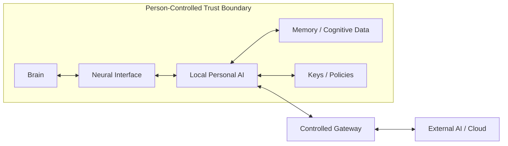

# Cognitive Sovereignty Architecture

## Human–AI Cognitive Security Reference Architecture の試論

> **Status:** Draft v0.3  
> **Scope:** Human–AI融合、BCI、Personal AI、認知補助システムを想定した倫理・セキュリティ設計  
> **Goal:** 既存のneurorightsを、実装可能なsecurity architectureへ翻訳する

AIが脳や神経系と接続され、記憶・判断・感情・身体制御の一部を補助するようになると、守るべき対象は単なるデータではなくなる。

本プロジェクトでは、**認知主権 Cognitive Sovereignty** を、

> 自分の思考、感情、記憶、神経状態、認知インフラについて、誰に読み取らせるのか、何を推論させるのか、どのような介入を許すのか、そして自分自身をどのように変化させるのかを、最終的に本人が決定できる状態

と定義する。

## このプロジェクトの中心となる3つの提案

### 1. 精神的オフライン権

単なる接続解除ではなく、次を含む権利として整理する。

- Offline Survivability
- Portability
- Exit
- Local Control

外部AIやクラウドとの接続を失っても、最低限の認知機能と主体性を維持できることを目標とする。

### 2. Person-Controlled Trust Boundary

身体の内外ではなく、**本人が最終的に管理する認知ドメイン**をセキュリティ境界とする。

### 3. Transformation History Integrity

自己同一性そのものを暗号で証明するのではなく、

- Model update
- Firmware update
- Policy change
- Permission grant / revoke
- Neural stimulation
- Cognitive memory modification
- Emergency override

などの**認知変容履歴の真正性・完全性・検証可能性**を守る。

## 設計目標

このArchitectureの中心的な目標は、

> **AI、クラウド、デバイス、運用者のいずれかが侵害されても、単独では人間の認知主権を奪えないこと**

である。

そのために、

- Least Privilege
- Separation of Authority
- Independent Actuation Control
- Attestation
- Cryptographic Provenance
- Verifiable Audit
- Recovery / Revocation
- Offline Survivability

を組み合わせる。

## 文書構成

- [Architecture](docs/ARCHITECTURE.md)  
  PCTB、Capability Model、Actuation Control、Attestation、Recovery

- [Threat Model](docs/THREAT_MODEL.md)  
  Assets、Adversaries、Trust Assumptions、Security Goals

- [Ethics](docs/ETHICS.md)  
  認知主権、精神的オフライン権、自己の連続性、介入レベル

- [Related Work](docs/RELATED_WORK.md)  
  neurorights、trusted computing、provenanceとの関係と差分

- [Policy Model](spec/POLICY_MODEL.md)  
  Cognitive Capability Authorizationの決定的semantics

- [Policy JSON Schema](spec/policy.schema.json)  
  Policy構造の機械検証用schema

- [Authorization Test Vectors](tests/authorization-vectors.yaml)  
  実装間でALLOW / DENY結果を一致させるためのconformance例

- [Illustrative Policy Example](examples/policy-example.yaml)  
  概念を具体化するための機械可読例

## Non-Goals

このプロジェクトは次を保証しない。

- 哲学的な自己同一性の証明
- AIの倫理的正しさ
- 同意の完全な自発性の暗号学的証明
- 神経技術の医学的有効性
- 現在の脳オルガノイドに意識があるという主張
- 政治・法律・医療倫理を技術だけで解決すること

## 結論

重要なのは、人間を現在の形のまま保存することではない。

**変化する自由**と、**変化させられない自由**を同時に守ることである。

## AIと深く融合したとしても、自分が何者になるかを自分自身で選択できる未来を目指す。
