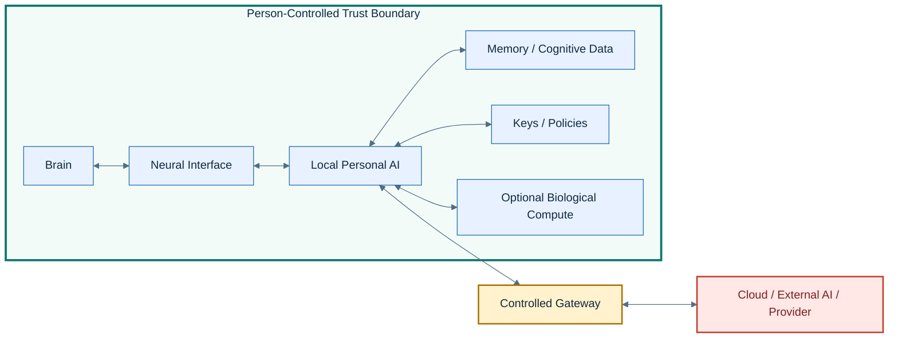
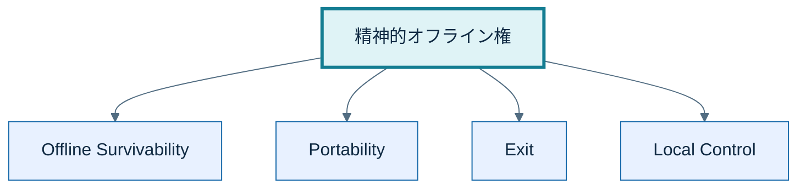
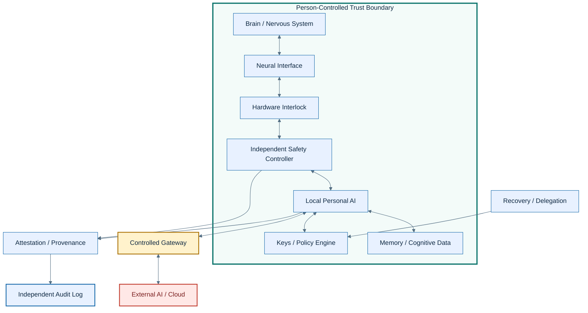

# Cognitive Sovereignty Architecture
## Human–AI Cognitive Security Reference Architecture の試論

> **Status:** Draft v0.2  
> **Scope:** Human–AI融合、BCI、Personal AI、認知補助システムを想定した倫理・セキュリティ設計の試論  
> **Goal:** 既存のneurorightsを、実装可能なsecurity architectureへ翻訳する

---

## 0. この文書の位置づけ

AIが人間の外部にある道具である限り、AIの安全性は主として情報セキュリティ、プライバシー、モデル安全性の問題として扱える。

しかし、AIが脳や神経系と接続され、記憶、判断、感情、身体制御などの一部を補助するようになると、保護すべき対象は単なるデータではなくなる。

将来的には、

- BCIによる神経信号の読み取り
- 神経刺激を含む双方向インターフェース
- 個人に長期適応するPersonal AI
- 身体外に存在する認知補助装置
- 脳オルガノイドなどの生体計算資源

が、一つの認知システムとして協調する可能性がある。

このとき必要になるのが、**認知主権 Cognitive Sovereignty** である。

本稿では認知主権を、

> 自分の思考、感情、記憶、神経状態、認知インフラについて、誰に読み取らせるのか、何を推論させるのか、どのような介入を許すのか、そして自分自身をどのように変化させるのかを、最終的に本人が決定できる状態

と定義する。

ただし、この文書は認知主権という語そのものを新規に発明したと主張するものではない。  
既存の **Mental Privacy / Mental Integrity / Cognitive Liberty / Psychological Continuity** などのneurorights・神経倫理上の概念を、**Human–AI Cognitive Securityの設計原則へ落とし込むこと**を目的とする。

この文書で特に独自に整理するのは次の3点である。

1. **精神的オフライン権**  
   Offline Survivability / Portability / Exit / Local Control として定義する

2. **Person-Controlled Trust Boundary**  
   身体の内外ではなく、本人が最終管理する認知ドメインをセキュリティ境界とする

3. **Transformation History Integrity**  
   自己同一性そのものではなく、自分がどのように変化してきたかの履歴完全性を守る

---

# 1. AIが脳に近づくと、守る対象が変わる

現在のスマートフォンやPCで問題になるのは、主にデータの盗難、改ざん、なりすましである。

しかしAIが神経系へ近づくほど、問題は段階的に変化する。


神経信号を**読む**場合にはMental Privacyが問題になる。  
神経系へ**書く**場合にはMental IntegrityやAutonomyが問題になる。

さらに、直接神経刺激をしなくても、Personal AIが表示、音声、AR、推薦、ナビゲーションを個人の状態に合わせて最適化すれば、認知へ強く影響できる。

そのため、認知への介入は二値ではなく、層として扱う。

---

# 2. Cognitive Intervention Levels

認知への介入をすべて同じものとして扱うと、通常の教育や助言までセキュリティ介入になってしまう。

そこで、本稿では認知への影響を次の4層に分ける。

| Level | 種類 | 例 | 主な論点 |
|---|---|---|---|
| **L1** | Direct Neural Actuation | 電気刺激、磁気刺激、埋込電極 | 身体・精神の完全性、安全性 |
| **L2** | Neural Inference | 神経信号から意図や状態を推定 | Mental Privacy、推論権限 |
| **L3** | Adaptive Cognitive Manipulation | 個人状態に適応した推薦、AR、音声誘導 | 自律性、長期的影響、透明性 |
| **L4** | Ordinary Information / Persuasion | 一般的な情報、広告、助言 | 通常の情報倫理・メディア倫理 |

Cognitive Sovereignty Architectureが最も強く制御すべきなのは、L1とL2である。  
L3は技術的な境界が曖昧になりやすく、今後の制度設計が重要になる。  
L4は通常の情報社会における説得や表現の問題と区別する。

---

# 3. 認知主権を構成する権利

認知主権は単一の権利ではなく、複数の原則を束ねる上位概念として扱う。

| 構成要素 | 守るもの |
|---|---|
| **Mental Privacy** | 思考・神経状態・推論結果を無断で取得されない |
| **Mental Integrity** | 精神状態を本人の意思に反して変更されない |
| **Cognitive Liberty** | 自分を変える自由と、変えない自由 |
| **Psychological Continuity** | 人格や精神生活の連続性を不当に侵害されない |
| **精神的オフライン権** | 外部AIとの接続を断っても認知機能を維持できる |
| **Control of Cognitive Infrastructure** | Personal AI、認知データ、鍵、補助装置を本人が最終管理する |

2017年、Ienca & Andornoは cognitive liberty, mental privacy, mental integrity, psychological continuity の4つを神経技術時代に重要となる権利として整理した。  
UNESCOも2025年にRecommendation on the Ethics of Neurotechnologyを採択しており、神経技術の倫理はすでに国際的な制度論の対象になっている。

本稿の目的は、これらをそのまま再定義することではなく、**セキュリティ境界、権限管理、監査、復旧可能性へ翻訳すること**である。

---

# 4. Threat Model

Architectureとして最初に必要なのは、誰から何を守るのかを明示することである。

## 4.1 Assets

保護対象は次の通り。

| Asset | 侵害された場合の影響 |
|---|---|
| Neural raw data | 神経状態の漏洩 |
| Derived mental inference | 感情、意図、嗜好、判断傾向の無断推定 |
| Personal AI memory | 記憶補助や長期コンテキストの漏洩・改ざん |
| Stimulation capability | 不正な神経刺激 |
| Cognitive history | 変更履歴の改ざん |
| Cryptographic keys | 本人権限の奪取 |
| Consent / policy state | 本人の許可条件の書き換え |
| Personal AI model | 行動・出力・判断補助の改ざん |
| Firmware / hardware state | 安全機構の無効化 |

## 4.2 Potential Adversaries

想定する攻撃者には、外部の犯罪者だけでなく、正規のアクセス権を持つ主体も含む。

```text
Cloud Provider
Device Manufacturer
Malware / Remote Attacker
Clinician / Operator
Employer
Government
Physical Attacker
Compromised Personal AI
Compromised Safety Controller
Insider
```

ここで重要なのは、AIそのものを善意の主体として前提にしないことである。

**AIモデルが侵害される、誤作動する、または不適切な目的関数を持つ可能性を前提に設計する。**

## 4.3 Security Goals

最低限の目標は次の通り。

- Confidentiality
- Integrity
- Availability
- Authenticity
- Authorization
- Revocability
- Auditability
- Recoverability
- Offline Survivability

---

# 5. Person-Controlled Trust Boundary

身体の中にあるものが本人で、身体の外にあるものが外部、という区分では将来の認知システムを扱えない。

長期間利用するPersonal AI、記憶補助装置、BCI制御装置は、身体外に存在していても実質的に認知の一部になる可能性がある。

そこで、物理的な身体境界ではなく、**本人が最終的に管理する信頼境界**を定義する。

これを **Person-Controlled Trust Boundary: PCTB** と呼ぶ。



考え方は、

**Brain ≠ Person**

ではなく、

**Brain + trusted cognitive extensions = protected cognitive domain**

である。

ただしPCTB内部の全要素を無条件に信用するわけではない。  
PCTBとは、本人が**ポリシー、鍵、更新、権限、撤回**について最終的な統制を持つ領域を意味する。

---

# 6. Capability Model

アクセス権限を単純なread/writeだけで表現すると粗すぎる。

認知システムでは、少なくとも次のCapabilityを分離する。

| Capability | 内容 |
|---|---|
| Observe | 生の神経信号を取得する |
| Infer | 神経信号から状態・意図を推論する |
| Store | 認知データや推論を保存する |
| Recommend | 人間へ情報や選択肢を提示する |
| Propose Actuation | 神経刺激を提案する |
| Approve Actuation | 刺激を許可する |
| Execute Actuation | 実際に刺激する |
| Modify Model | Personal AIのモデルや設定を変更する |
| Modify Policy | 認知アクセス権限を変更する |
| Export | データをPCTB外へ送る |

原則は **Least Privilege** とする。

AIが神経刺激を必要と判断しても、AI自身にExecute Actuation権限を与える必要はない。

---

# 7. Independent Actuation Control

最も危険なCapabilityは、神経系への直接的なActuationである。

AIが提案することと、実際に刺激することを分離する。

```mermaid
%%{init: {"theme":"base","themeVariables":{
  "background":"#FFFFFF",
  "primaryColor":"#E8F1FF",
  "primaryTextColor":"#102A43",
  "primaryBorderColor":"#1769AA",
  "secondaryColor":"#DDF4EE",
  "tertiaryColor":"#FFF2CC",
  "lineColor":"#526D82",
  "textColor":"#102A43"
}}}%%
flowchart LR
    A[AI<br>Propose] --> S[Safety Controller<br>Validate]
    S --> P[User Policy<br>Authorize]
    P --> H[Hardware Interlock<br>Enforce Limits]
    H --> N[Neural Interface<br>Execute]
    N --> B[Human Nervous System]

    style A fill:#E8F1FF,stroke:#1769AA,stroke-width:2px,color:#102A43
    style S fill:#DDF4EE,stroke:#0F766E,stroke-width:2px,color:#102A43
    style P fill:#DDF4EE,stroke:#0F766E,stroke-width:2px,color:#102A43
    style H fill:#FFF2CC,stroke:#A96F00,stroke-width:2px,color:#102A43
    style N fill:#FFE8E6,stroke:#C0392B,stroke-width:2px,color:#7A1F1F
```



原則として、

> **AI may propose. Independent systems must authorize and constrain actuation.**

とする。

Safety Controllerも単一障害点にしないことが望ましい。  
重要な刺激では、複数条件の一致、ハードウェア上限、時間制限、物理的停止機構を組み合わせる。

---

# 8. Cryptographic Proof ≠ Physical Truth

ZKPやデジタル署名は重要だが、暗号学的証明と物理世界の事実を混同してはいけない。

ZKPが証明できるのは、基本的にはある数学的statementが成立することである。

たとえば、

- 有効なcredentialを持っている
- 署名されたポリシーに適合する
- 記録された刺激値が許容範囲内である

といった条件は証明できる。

しかし、

- 実機で本当にそのファームウェアが動いている
- 実際の電極出力が記録値と一致している
- センサーが物理的に改ざんされていない

ことは、ZKPだけでは保証できない。

そのため、物理システムへ接続するには次のようなchain of trustが必要になる。


NISTもhardware roots of trustとremote attestationを、実行プラットフォームのintegrityを測定・証明するための仕組みとして扱っている。

同じ考え方は神経刺激にも必要である。

**Commanded stimulation ≠ Delivered stimulation**

である。

そのため、重要な用途では出力側の測定・feedback・hardware limitまで含める必要がある。

---

# 9. Psychological Continuity と Transformation History Integrity

Psychological Continuityは既存のneurorights・神経倫理で用いられる概念であり、人格や精神生活の連続性を外部介入から守る問題を含む。

一方、本稿で工学的に扱いたいのは少し異なる。

暗号技術によって、

> 自分が同じ自分であること

を証明することはできない。

しかし、

> 自分がどのように変化してきたのか

について、変更履歴のintegrityを検証可能にすることはできる。

これを本稿では **Transformation History Integrity** と呼ぶ。

対象には例えば次が含まれる。

- Personal AI model update
- Firmware update
- Policy change
- Permission grant / revoke
- Neural stimulation event
- Cognitive memory modification
- Key rotation
- External model access
- Emergency override

```text
Identity itself
    ≠ cryptographically provable

Transformation history
    = can be signed
    = can be committed
    = can be audited
    = can be verified
```

したがって、Cognitive Sovereignty Architectureが保証するのは人格同一性そのものではなく、**認知変容履歴の真正性・完全性・検証可能性**である。

---

# 10. 精神的オフライン権

Personal AIが認知システムの一部になれば、単なるright to disconnectでは不十分になる。

外部サービスとの接続を失ったときにも、自分として存続できる必要がある。

精神的オフライン権を次の4要素で定義する。

## 10.1 Offline Survivability

クラウドや外部AIとの通信が停止しても、最低限必要な記憶、認知補助、本人確認、安全制御が機能すること。

## 10.2 Portability

Personal AI、認知データ、設定、長期記憶などを別システムへ移行可能であること。

## 10.3 Exit

企業、医療機関、クラウド事業者などとの関係を終了しても、本人の基礎的認知機能が失われないこと。

## 10.4 Local Control

重要な鍵、権限ポリシー、認知データ、緊急停止手段について、本人または本人が事前指定した主体が最終的な統制を持つこと。



これは、認知機能についてのvendor lock-inを避けるための原則でもある。

---

# 11. Provenance / ZKP / Verifiable Log

認知履歴の検証に、すべてをブロックチェーンへ保存する必要はない。

むしろ、生の神経データや詳細な認知履歴を公開台帳へ保存することは避けるべきである。

より自然なのは、


という構造である。

Certificate Transparencyで利用されているようなappend-only Merkle logは、履歴の一貫性や改ざん検知の参考モデルになる。

ZKPは、

- 許可された条件に適合している
- 特定の秘密情報を公開せず資格を持つことを示す
- 詳細履歴を公開せずポリシー適合性だけを示す

といった用途に向く。

一方、ZKPだけでは、

- 本人が内容を理解していたか
- 強制されていなかったか
- 現在も同意しているか

までは保証できない。

そのため、

**Cryptographic validity ≠ Ethical legitimacy**

である。

---

# 12. Failure / Recovery / Delegation Model

本人がすべての秘密鍵を単独管理すれば認知主権が守られる、とは限らない。

現実には、

- 意識喪失
- 認知能力低下
- 鍵紛失
- 端末破損
- 医療緊急時
- 本人死亡
- 攻撃下での強制

などがある。

したがって、ArchitectureにはRecoveryを最初から含める。

最低限、次の4つが必要になる。

| Mechanism | 目的 |
|---|---|
| Delegation | 事前指定した代理人・医療者へ限定権限を渡す |
| Recovery | 鍵や端末を失った際に安全に復旧する |
| Emergency Access | 生命に関わる状況で限定的なbreak-glass accessを許す |
| Revocation | 侵害された鍵・装置・AI・代理権限を失効させる |

重要なのは、緊急アクセスが通常アクセスへ恒久化しないことである。

Emergency Accessには、

- 最小権限
- 時間制限
- 目的制限
- 強制監査ログ
- 事後通知
- 自動失効

を求める。

---

# 13. 脳オルガノイドの扱い

脳オルガノイドを計算へ利用する研究はすでに存在する。

2023年のBrainowareでは、脳オルガノイドへ電気刺激を与え、その活動を読み取るreservoir computingが実証された。  
Organoid Intelligenceも、生体神経組織を計算へ利用する研究領域として提案されている。

ただし、現在の脳オルガノイドに、

- 人間レベルの記憶
- 人格
- 自己意識
- 主体的価値判断

が存在すると示されたわけではない。

したがって、

> オルガノイドが長期記憶や人格形成に機能的に統合される

という議論は、**将来仮説**として明確に分ける。

仮に将来そのような統合が起きた場合には、セキュリティ問題だけでなく、

- 本人の一部か
- 独立した主体か
- 所有可能な計算資源か
- 停止・交換・複製にどのような倫理的制約があるか

という別のmoral status問題が生じる。

---

# 14. Design Principles

Cognitive Sovereignty Architectureの基本原則を次のようにまとめる。

## Local-first

高機密な認知処理はPCTB内部で処理する。

## Data Minimization

外部へ送る神経・認知情報を必要最小限にする。

## Least Privilege

AI、アプリ、医療者、クラウドに必要以上のCapabilityを与えない。

## Independent Actuation Control

AIと神経刺激の実行権限を分離する。

## Cryptographic Provenance

モデル、ファームウェア、ポリシー、認知履歴の出所と変更を検証可能にする。

## Continuous Verification

secure boot、attestation、command authentication、integrity verificationを継続的に行う。

## Offline Survivability

外部ネットワークなしでも最低限の認知機能を保つ。

## Portability / Exit

サービス事業者を変更・離脱しても自己の認知資産を失わない。

## Recoverability

本人が通常状態で操作できない場合にも、事前ルールに基づいて安全に復旧できる。

---

# 15. Reference Architecture



このArchitectureで重要なのは、

> **本人がAIを完全に信用すること**

ではない。

むしろ、

> **AI、クラウド、デバイス、運用者のいずれかが侵害されても、単独では人間の認知主権を奪えないこと**

を目標にする。

---

# 16. Non-Goals

この文書は次を保証しない。

- 哲学的な自己同一性の証明
- AIが倫理的に正しい判断をすること
- 同意が完全に自発的であることの暗号学的証明
- 神経技術の医学的有効性
- 現在の脳オルガノイドに意識があるという主張
- すべての認知への影響を技術的に防ぐこと
- 政治・法律・医療倫理をセキュリティ技術だけで解決すること

---

# 17. Open Questions

今後さらに詰めるべき論点は多い。

- PCTBの最小構成は何か
- 本人の鍵を誰がどの条件でrecoveryできるか
- 本人の認知能力が変化した場合のconsentをどう扱うか
- Emergency Accessの濫用をどう防ぐか
- L3 Adaptive Cognitive Manipulationをどこから規制対象にするか
- Personal AIのlong-term memoryをどこまで本人の一部として扱うか
- AIモデル更新が人格形成に与える影響をどう監査するか
- 認知データのportability標準をどう設計するか
- 神経刺激のphysical attestationをどう実装するか
- organoid computeがmoral statusを持つ条件をどう考えるか

---

# 18. Conclusion

Human–AI融合について考えるとき、目標を人間を現在の形のまま保存することに置く必要はない。

重要なのは、

**変化する自由**と  
**変化させられない自由**

を同時に守ることである。

AIとの接続を望む人にはその自由がある。  
接続を拒否したい人にもその自由がある。  
認知能力を拡張したい人にもその自由がある。  
現在の自分を維持したい人にもその自由がある。

そのために必要なのが、

- Cognitive Sovereignty
- Person-Controlled Trust Boundary
- Least Privilege
- Independent Actuation Control
- Transformation History Integrity
- Cryptographic Provenance
- Verifiable Audit
- Offline Survivability
- Portability
- Recovery / Revocation

である。

## AIと深く融合したとしても、自分が何者になるかを自分自身で選択できる未来を目指す。

---

# References

1. Ienca, M. & Andorno, R. **Towards new human rights in the age of neuroscience and neurotechnology.** *Life Sciences, Society and Policy* 13, 5 (2017).  
   https://pubmed.ncbi.nlm.nih.gov/28444626/  
   DOI: 10.1186/s40504-017-0050-1

2. UNESCO. **Recommendation on the Ethics of Neurotechnology.** Adopted at the 43rd session of the General Conference (2025).  
   https://www.unesco.org/en/node/86248

3. Jiang, X. et al. **Cybersecurity in neural interfaces: Survey and future trends.** *Computers in Biology and Medicine* 167, 107604 (2023).  
   https://pubmed.ncbi.nlm.nih.gov/37883851/  
   DOI: 10.1016/j.compbiomed.2023.107604

4. Cai, H. et al. **Brain organoid reservoir computing for artificial intelligence.** *Nature Electronics* 6, 1032–1039 (2023).  
   https://www.nature.com/articles/s41928-023-01069-w  
   DOI: 10.1038/s41928-023-01069-w

5. Smirnova, L. et al. **Organoid intelligence (OI): the new frontier in biocomputing and intelligence-in-a-dish.** *Frontiers in Science* 1 (2023).  
   https://www.frontiersin.org/journals/science/articles/10.3389/fsci.2023.1017235/full  
   DOI: 10.3389/fsci.2023.1017235

6. NIST CSRC. **Zero-Knowledge Proof — Glossary.**  
   https://csrc.nist.gov/glossary/term/zero_knowledge_proof

7. NIST. **Using Hardware-Enabled Security to Ensure System Platform Integrity** — hardware roots of trust and remote attestation.  
   https://www.nist.gov/publications/using-hardware-enabled-security-ensure-5g-system-platform-integrity-applying-5g

8. RFC 6962. **Certificate Transparency.** Append-only Merkle logs and consistency proofs.  
   https://www.rfc-editor.org/rfc/rfc6962
