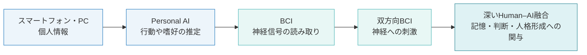
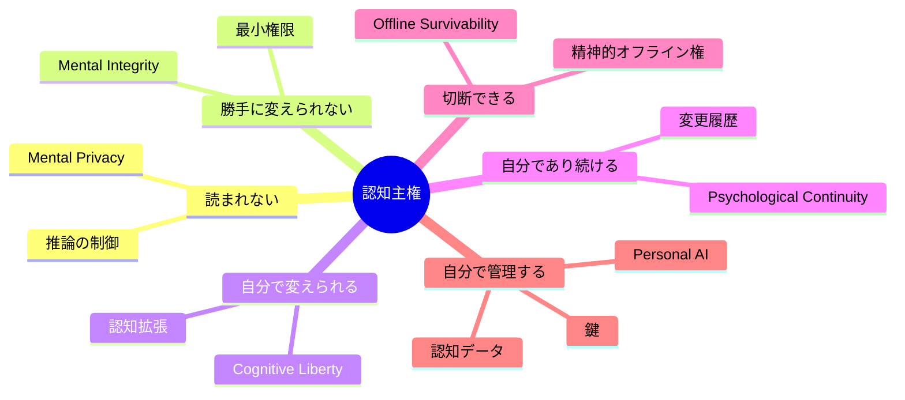
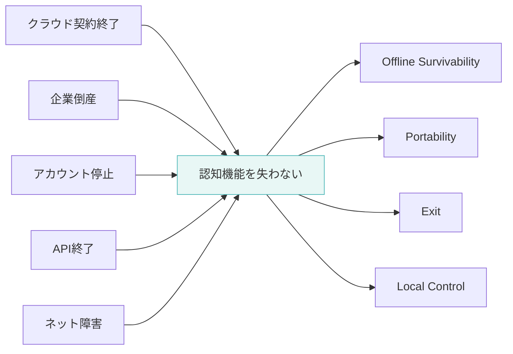
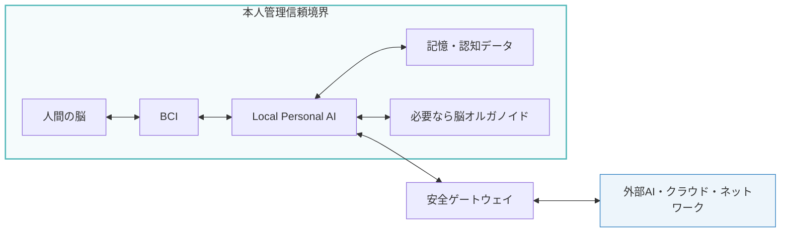
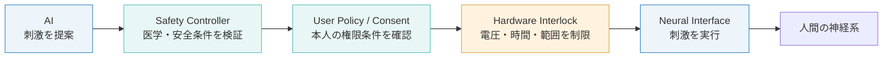
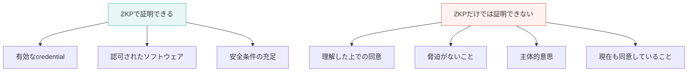
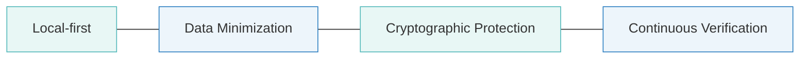
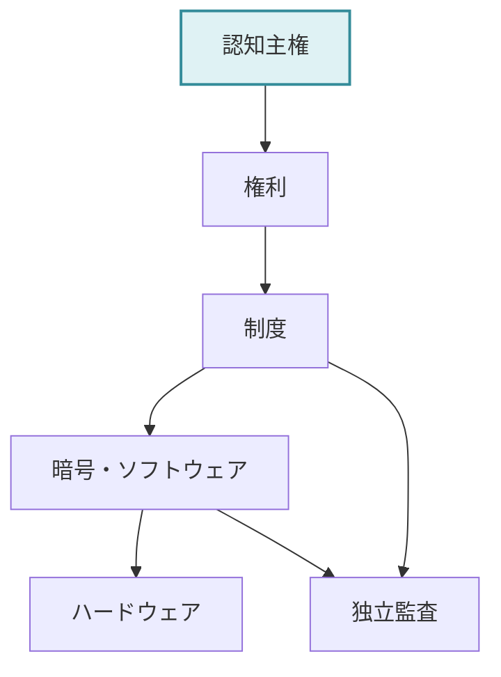
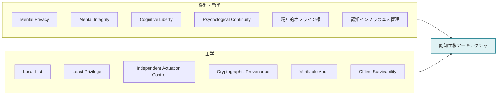

# 人間とAIが融合する未来に必要な認知主権
## Cognitive Sovereignty Architecture の試論

AIが人間の外部にある道具である限り、AIの安全性は主として情報セキュリティや個人情報保護の問題として扱える。

しかし、AIが脳や神経系と直接接続され、記憶、判断、感情、身体制御などの一部を補助するようになれば、保護すべき対象は情報だけではなくなる。さらに将来、脳オルガノイドのような生体神経組織が計算資源として利用され、人間の脳、AI、生体神経組織が一つの認知システムとして協調するようになれば、AIシステムへの介入は、そのまま人間の認知への介入になり得る。

このとき必要になるのが、**認知主権**という考え方である。

認知主権とは、自分の思考、感情、記憶、神経状態について、誰に読み取らせるのか、何を推論させるのか、どのような介入を許すのか、そして自分自身をどのように変化させるのかを、最終的に本人が決定できる状態を指す。

本稿では、この認知主権を中心に、自己の連続性、精神的オフライン権、本人管理信頼境界、暗号技術、脳オルガノイドを含むHuman–AI融合の安全設計について整理する。

---

# 1. AIが脳に近づくと、守る対象が変わる

現在のスマートフォンやPCで問題になるのは、主にデータの盗難、改ざん、なりすましである。

しかし、AIが神経系へ近づくにつれて、問題は段階的に変化する。



AIが脳から情報を**読む**場合、中心になるのは精神的プライバシーである。

将来、神経信号から単なる運動意図だけではなく、

- 何に注意を向けているか
- 何をしようとしているか
- どの刺激を嫌っているか
- どの選択肢を選びやすいか

といった情報まで推論できるようになれば、生の神経データだけを保護しても十分ではない。

重要になるのは、**自分について何を推論させてよいのか**まで本人が決められることである。

一方、AIが神経系へ情報を**書く**場合には、精神的完全性や自律性が問題になる。

神経刺激は、感覚の回復、運動制御、治療などに利用できる可能性がある。しかし同時に、認知状態へ影響を与える経路にもなり得る。

ただし、AIに直接的な神経刺激権限を与えなければ安全、というほど単純ではない。

AIが神経へ直接writeしなくても、表示、音声、AR、推薦、ナビゲーションを通じて人間の認知へ影響を与えることはできる。

したがって、重要なのは単純なread-onlyではなく、**最小権限**である。

---

# 2. 認知主権とは何か

認知主権は、一つの権利というより、複数の既存概念を統合する上位原則として考えられる。

| 構成要素 | 守るもの |
|---|---|
| Mental Privacy | 思考や神経状態を勝手に読み取られない |
| Mental Integrity | 精神状態を本人の意思に反して変更されない |
| Cognitive Liberty | 自分を変える自由と、変えない自由 |
| Psychological Continuity | 自分がどのように変化してきたかを把握できる |
| 精神的オフライン権 | 外部AIやネットワークとの接続を拒否できる |
| 認知インフラの本人管理 | Personal AI、鍵、記憶、補助装置を本人が最終管理する |

これを図にすると、認知主権は次のように整理できる。



認知主権の中心は、単に思考を秘密にできることではない。

**自分が何者になるのかを、自分自身で決定できること**である。

---

# 3. 自己の連続性

AIとの融合が深くなると、自己の連続性が重要になる。

たとえば、最初は記憶検索を補助するだけだったPersonal AIが、数年後には意思決定を補助し、さらに神経インターフェースと接続され、その後、生体神経組織まで認知系へ統合されたとする。

その変化が少しずつ進めば、本人は常に自分は自分であると感じ続ける可能性がある。

これはテセウスの船に似ている。

```text
本人
 ↓
Personal AIを導入
 ↓
記憶補助を追加
 ↓
判断補助を追加
 ↓
BCIを追加
 ↓
生体神経組織を追加
 ↓
AIモデルを何度も更新
 ↓
現在の本人
```

この過程で重要なのは、**自己の連続性そのものを暗号技術で証明することはできない**という点である。

暗号技術が証明できるのは、

- いつ変更が行われたか
- どのAIモデルが使われたか
- どの権限で処理されたか
- どの刺激が行われたか
- 認証されたハードウェアが使われたか
- 不正な変更が検出されたか

といった、**自己変容の履歴の完全性**である。

したがって目標は、

> 自分が同じ自分であることを数学的に証明すること

ではなく、

> **自分がどのように変化してきたのかを検証可能にすること**

である。

これはidentityそのものの証明ではなく、**identity transformation historyのintegrityを守ること**と考えられる。

---

# 4. 精神的オフライン権

AIが自分の認知システムの一部になった場合、データを守るだけでは不十分になる。

重要なのは、**外部AIやネットワークとの接続を断っても、自分として存在し続けられること**である。

これを精神的オフライン権と呼ぶ。

精神的オフライン権には少なくとも次の四つが含まれる。

### Offline Survivability

外部AIやクラウドとの接続がなくても、最低限の記憶、判断、認知機能を維持できること。

### Portability

Personal AI、認知データ、記憶補助システムなどを、別のシステムへ移行できること。

### Exit

特定の企業、医療機関、サービス提供者との関係を終了できること。

### Local Control

重要な鍵、認知ポリシー、Personal AI、神経インターフェースの権限を本人が最終的に管理できること。

この意味で、精神的オフライン権は単なるネット切断権ではない。

**認知機能についてvendor lock-inされない権利**でもある。



---

# 5. 本人内完結ではなく、本人管理信頼境界

認知主権を工学的に考えると、脳内完結という表現だけでは不十分である。

Personal AIや脳オルガノイドは、必ずしも頭蓋内や身体内に置かれるとは限らない。

重要なのは物理的な内外ではなく、**誰が最終的に管理する信頼領域にあるか**である。

そこで、本人管理信頼境界  
**Person-Controlled Trust Boundary**  
という考え方を導入する。



この構造では、

**Brain ≠ Person**

であり、

**Brain + trusted cognitive extensions = protected cognitive domain**

と考える。

つまり脳だけを守るのではなく、本人の記憶、Personal AI、認知補助装置、BCIなどを含む一つの認知ドメインを守る。

クラウドや外部AIは、その外側に置く。

これによって、身体外のPersonal AIを利用しながらも認知主権を維持する設計が可能になる。

---

# 6. AIと神経系の間には独立した安全層が必要

AIの権限については、read-onlyを原則とするより、**Least PrivilegeとIndependent Actuation Control**を採用する方が適切である。

たとえばAIが神経刺激を必要だと判断した場合でも、AI自身が直接刺激を実行しない。



ここで重要なのは、

**AIが提案すること**と  
**AIが実行すること**を分離することである。

AIが侵害されたとしても、独立した安全層を突破しなければ直接神経へ書き込めない構造を作る。

これは通常のコンピューターセキュリティにおける最小権限や権限分離を、神経系まで拡張した考え方である。

---

# 7. 脳オルガノイドはどこまで現実的か

脳オルガノイドを計算に利用する研究自体は、すでに存在する。

生体神経組織へ電気信号を入力し、その反応を読み取って計算に利用するという基本構造は研究されている。

したがって、

```text
AI
 ↓ 電気刺激
脳オルガノイド
 ↓ 神経活動
AI
```

という構造そのものは、完全なSFではない。

しかし、ここから先は現在と未来仮説を明確に分ける必要がある。

現時点の脳オルガノイドが、

- 人間レベルの記憶
- 人格
- 自己意識
- 主体的な価値判断

を持つと示されたわけではない。

したがって、本稿で扱う、

> オルガノイドが人間の記憶や人格形成に長期的に参加する可能性

は、**将来仮説**として扱うべきである。

仮に将来、オルガノイドが長期記憶や人格形成に機能的に統合されるなら、オルガノイドを交換、停止、更新することは、単なるハードウェア交換ではなくなる可能性がある。

その段階では、

- 本人の一部なのか
- 独立した生体知性なのか
- 所有物なのか
- 新しい主体なのか

という倫理問題が生じる。

---

# 8. ZKPは何を守れるのか

ZKPは非常に有用だが、できることとできないことを分ける必要がある。

ZKPが得意なのは、

> **秘密情報そのものを公開せず、ある条件を満たしていることだけを証明すること**

である。

たとえば、

- 認可されたファームウェアが動いている
- 神経刺激パラメータが安全範囲内である
- 有効な認証credentialを持っている
- 本人の許可条件に一致する署名が存在する

といった事実はZKPと相性が良い。

一方で、ZKPは、

- 本人が内容を本当に理解したか
- 脅迫されていなかったか
- 認知能力が十分だったか
- 現在も同意しているか

までは証明できない。

つまり、ZKPが扱えるのは**暗号学的事実**であって、本人の内面的な意思そのものではない。



そのため、ZKPは認知主権を単独で保証する技術ではなく、**認知主権を支える検証技術の一つ**と位置付けるべきである。

---

# 9. 分散台帳は必須ではない

変更履歴を改ざんされにくくするという目的に対して、分散台帳は有力な選択肢ではある。

しかし、必ずしもブロックチェーン型の分散台帳が必要というわけではない。

認知履歴の検証には、

- append-only transparency log
- Merkle tree
- デジタル署名
- hash / commitment
- 独立監査
- 必要に応じた分散台帳

などの組み合わせも考えられる。

特に認知データは極めて機密性が高いため、詳細な神経履歴そのものを公開台帳へ記録する設計は避けるべきである。

より自然なのは、


という構造である。

詳細情報は本人管理下に置き、外部には改ざん検知に必要な証拠だけを残す。

この方がZKPとの相性も良い。

---

# 10. セキュリティは順位ではなく多層防御として考える

以前の考え方として、

> Isolation → Minimization → Encryption → Verification

という順序を想定できる。

しかし、これは厳密な順位というより、複数の防御原則として考える方が適切である。

より工学的には次のように整理できる。

## Local-first

最も機密性の高い認知処理は、本人管理信頼境界の内部で処理する。

## Data Minimization

外部に出す情報を必要最低限にする。

## Cryptographic Protection

外部へ出す情報は通信時、保存時、必要に応じて計算時にも保護する。

## Continuous Verification

認証、secure boot、integrity verification、command authentication、監査などを継続的に行う。



ここで重要なのは、暗号技術だけに依存しないことである。

暗号化されていても、

- 実装バグ
- 秘密鍵の侵害
- ハードウェア脆弱性
- サプライチェーン攻撃
- 設定ミス
- 内部者攻撃

などは残る。

そのため、認知主権を守るには、**攻撃面そのものを減らす設計**が必要になる。

---

# 11. 認知主権は技術だけでは成立しない

どれほど強い暗号技術を使っても、制度そのものが本人の主権を認めなければ意味がない。

たとえば企業や政府が、

- 就職条件として常時BCI接続を要求する
- 精神状態の証明を強制する
- Personal AIの使用を特定企業に限定する
- 接続を拒否した人を不利益に扱う

といった制度を作れば、暗号技術が完璧に動いていても認知主権は侵害される。

したがって、Human–AI融合には多層的なガバナンスが必要になる。



具体的には、

- 本人の同意
- 拒否権
- 接続しない権利
- Portability
- Exit
- 独立監査
- 企業や政府による認知操作の制限
- ハードウェアレベルの安全装置
- 暗号学的監査

などを組み合わせる必要がある。

---

# 12. Cognitive Sovereignty Architecture

ここまでの考えを一つのアーキテクチャとしてまとめると、次のようになる。

## 権利・哲学側

**Cognitive Sovereignty**

= Mental Privacy  
+ Mental Integrity  
+ Cognitive Liberty  
+ Psychological Continuity  
+ 精神的オフライン権  
+ Control of Cognitive Infrastructure

## 工学側

**Cognitive Sovereignty Architecture**

= Local-first  
+ Least Privilege  
+ Independent Actuation Control  
+ Cryptographic Provenance  
+ Verifiable Audit  
+ Offline Survivability  
+ Portability  
+ Person-Controlled Trust Boundary



---

# 13. 最終的に守るべきもの

Human–AI融合について考えるとき、目的を人間を現在の形のまま保存することに置く必要はない。

AIや生体神経組織によって、人間の認知能力や身体能力が変化する未来そのものを否定する必要もない。

重要なのは、**変化する自由と、変化させられない自由を同時に守ること**である。

自分を拡張したい人にはその自由がある。

現在の自分を維持したい人にも、その自由がある。

AIとの接続を望む人にはその自由がある。

切断して生きたい人にも、その自由がある。

そのために必要なのが、

- 認知主権
- 自己の連続性
- 精神的オフライン権
- 本人管理信頼境界
- 最小権限
- 独立した安全制御
- 検証可能な変更履歴
- ローカルで生存可能な認知システム

である。

最終的に目指すべきなのは、人間がAIとつながらない未来ではない。

## AIと深く融合したとしても、自分が何者になるかを自分自身で選択できる未来である。

