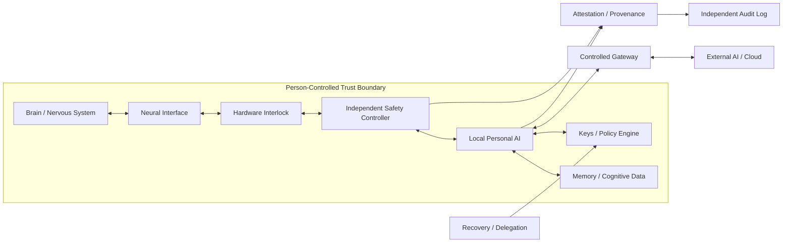
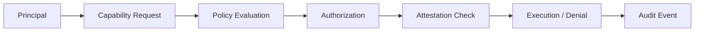
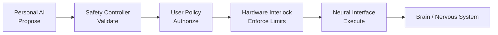
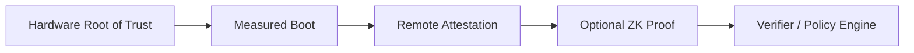
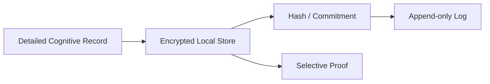

# Architecture

> **Status:** Draft  
> この文書は実装済みプロトコルや医療仕様ではなく、Human–AI Cognitive SecurityのReference Architecture案である。

# 1. System Goal

Cognitive Sovereignty Architectureの目標は、

> **単一の主体または単一の侵害によって、人間の認知への最終権限が奪われないこと**

である。

対象には、Personal AI、BCI、認知データ、神経刺激、鍵、ポリシー、外部AIとの通信が含まれる。

---

# 2. Person-Controlled Trust Boundary

PCTBは物理的な身体境界ではない。

本人が、次について最終的な統制を持つ領域を指す。

- access policy
- cryptographic keys
- capability grant / revoke
- model update policy
- data export policy
- emergency delegation
- recovery



PCTB内部の全要素を無条件に信用するわけではない。

PCTBは**本人が統制するsecurity domain**であり、その内部でも権限分離と継続的検証を行う。

---

# 3. Principals

PrincipalはCapabilityを要求する主体である。

想定Principal:

- Human user
- Personal AI
- Safety Controller
- Neural Interface
- Hardware Interlock
- Recovery Agent
- Clinician
- External AI
- Cloud Service
- Manufacturer Update Service
- Auditor

---

# 4. Capability Model

単純なread/writeではなく、認知システム上の権限をCapabilityとして分離する。

| Capability | 内容 |
|---|---|
| Observe | 生の神経信号を取得する |
| Infer | 神経信号から状態や意図を推論する |
| Store | 認知データや推論結果を保存する |
| Recommend | 人間へ情報や選択肢を提示する |
| ProposeActuation | 神経刺激を提案する |
| ApproveActuation | 神経刺激を承認する |
| ExecuteActuation | 刺激を実行する |
| ModifyModel | Personal AIのモデルを変更する |
| ModifyPolicy | 認知アクセス権限を変更する |
| Export | PCTB外へ情報を送信する |
| Delegate | 限定権限を第三者へ委任する |
| Revoke | 既存権限を失効させる |

原則は **Least Privilege** とする。

Principalそのものをtrusted / untrustedの一語で評価するのではなく、Capability単位で許可する。

---

# 5. Trust Assumptions

初期案として以下を置く。

| Component | Trust assumption |
|---|---|
| Human / User Policy | ultimate authority。ただし鍵喪失・判断能力低下を想定 |
| Personal AI | inference/recommendationには利用可能。actuation executionは非信頼 |
| Safety Controller | 独立実装・独立検証を要求 |
| Hardware Interlock | Trusted Computing Baseの一部 |
| Neural Interface | malfunction / compromise可能 |
| Cloud AI | PCTB外。原則非信頼 |
| Device Manufacturer | supply-chain / update riskを持つ |
| Audit Log | integrityを検証対象とする。confidentialityは別管理 |
| Recovery Agent | 事前委任された限定Capabilityのみ |

---

# 6. Authorization Flow

一般形は次の通り。



Authorizationでは少なくとも次を評価する。

- principal identity
- capability
- target
- purpose
- time window
- current consent state
- revocation state
- device integrity
- required co-approvals
- emergency status

---

# 7. Independent Actuation Control

最も高リスクなCapabilityはExecuteActuationである。

Personal AIには原則として、

- ProposeActuation: allow
- ApproveActuation: deny
- ExecuteActuation: deny

を初期値とする。



基本原則:

> **AI may propose. Independent systems must authorize and constrain actuation.**

Hardware Interlockでは、

- maximum amplitude
- pulse width
- duration
- target restrictions
- cooldown
- fail-safe stop

などの上限を、AIより下位の層で強制する。

---

# 8. Attestation

## 8.1 Cryptographic Proof ≠ Physical Truth

暗号学的に正しいstatementと、実世界で起きている物理状態は同一ではない。

そのため、実機状態を検証するにはchain of trustを用いる。



ZKPは、attestation evidenceの一部を秘匿したまま条件適合を示す用途に使える。

ただし、

**Commanded stimulation ≠ Delivered stimulation**

であるため、高リスク用途では実出力のmeasurementとfeedbackも必要になる。

---

# 9. Provenance

Transformation History Integrityの対象:

- Personal AI model version
- firmware version
- policy changes
- capability grant/revoke
- neural stimulation events
- memory modifications
- external model access
- emergency overrides
- recovery actions

詳細履歴はPCTB内部の暗号化ストレージに保存し、外部には必要に応じてhash / commitmentを残す。



---

# 10. Recovery and Delegation

認知主権は、本人が常に正常状態で鍵を操作できることを前提にしてはならない。

必要なMechanism:

- Delegation
- Recovery
- Emergency Access
- Revocation

Emergency Accessには最低限、

- least privilege
- purpose limitation
- time limitation
- mandatory audit
- post-event notification
- automatic expiry

を要求する。

---

# 11. Security Properties

本Architectureが目標とするproperty:

- Confidentiality
- Integrity
- Availability
- Authenticity
- Authorization
- Separation of Authority
- Revocability
- Auditability
- Recoverability
- Portability
- Offline Survivability
- Tamper Evidence

---

# 12. Illustrative Policy Lifecycle

```text
Principal
  ↓
Capability Request
  ↓
Policy Evaluation
  ↓
Attestation Evidence
  ↓
Authorization / Denial
  ↓
Execution
  ↓
Audit
  ↓
Revocation / Expiry
```

実例は `examples/policy-example.yaml` を参照。
