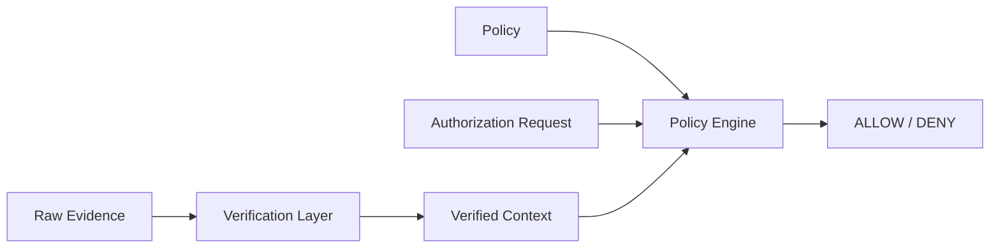

# Cognitive Capability Authorization Policy Model

> **Status:** Draft v0.1  
> **Purpose:** Cognitive Sovereignty Architecture におけるCapability Authorizationを、実装間で同じ意味になるよう定義するための最小仕様  
> **Important:** これは実装済み医療プロトコル、安全認証、臨床刺激仕様ではない。

---

# 1. Goal

この仕様の目標は、同じ正規化済みPolicy、Authorization Request、Verified Contextを与えたとき、準拠実装が**同じALLOW / DENY判定**を返すことである。

```text
Policy
  +
Authorization Request
  +
Verified Context
        ↓
Deterministic Policy Evaluation
        ↓
ALLOW / DENY
```

この仕様は、認知主権を抽象理念のまま扱うのではなく、

**Principal → Capability → Resource → Purpose → Constraints → Authorization**

という機械可読なモデルへ変換する。

---

# 2. Normative Language

本文中の **MUST / MUST NOT / SHOULD / MAY** は規範的要件として用いる。

v0.1では、実装差を減らすために意図的に機能を小さくする。

---

# 3. Semantic Boundary

Policy Engineは、暗号署名やRemote Attestationを直接解釈する層ではない。

暗号検証・証明検証・デバイス検証は先に行い、その結果を**Verified Context**としてPolicy Engineへ渡す。



これにより、

- signature verification
- certificate validation
- remote attestation
- ZK proof verification

と、

- policy semantics

を分離する。

**Cryptographic proof ≠ Physical truth** という原則は維持する。Verified Context自体の信頼性は、別レイヤーの責務である。

---

# 4. Canonical Data Model

## 4.1 Authoring Format

人間が編集する例ではYAMLを使用してよい。

ただし準拠実装は、Policyを評価する前にJSON互換データモデルへ正規化しなければならない。

YAMLを利用する場合は次をMUSTとする。

- UTF-8
- YAML 1.2 Core Schema
- duplicate key禁止
- custom tag禁止
- anchor / alias禁止
- timestampは文字列として明示
- authorizationに影響する数値は整数のみ

署名やhashの対象を将来標準化する場合は、JSON Canonicalization Schemeなどのcanonical representationを用いることを想定する。

## 4.2 Identifiers

`policy_id`, `principal.id`, `resource.id`, `issuer.id` などauthorizationに利用するidentifierはASCIIとし、case-sensitiveに比較する。

推奨形式:

```text
[A-Za-z0-9._:/-]+
```

表示名や日本語ラベルはauthorization semanticsに使用しない。

---

# 5. Policy Object

Policyは次のフィールドを持つ。

```yaml
spec_version: "0.1-draft"
policy_id: "cog.example.motor-assist"
policy_version: "1"

issuer:
  id: "user-policy-root"
  key_id: "key-2026-01"

principal:
  id: "personal-ai"
  type: "ai_agent"

capability:
  action: "propose_actuation"

resource:
  type: "neural_target"
  id: "motor-interface-1"

purpose: "motor_assistance"

constraints: []

not_before: "2026-01-01T00:00:00Z"
expires_at: "2027-01-01T00:00:00Z"

required_approvals:
  mode: "all"
  principals:
    - "user-policy"
    - "safety-controller"

attestation_requirements: []

audit_requirements:
  mandatory: true
  sink_required_for_allow: true

revocation_conditions:
  policy_must_be_active: true
  principal_must_be_active: true
  issuer_key_must_be_active: true
```

---

# 6. Field Semantics

## 6.1 `spec_version`

Policy semanticsのversion。

v0.1準拠実装は未知の`spec_version`をMUST DENYする。

## 6.2 `policy_id`

Policyの安定したidentifier。

同じ`policy_id`の意味を変更する場合でも、`policy_version`を変更しなければならない。

## 6.3 `policy_version`

Policyのversion。

v0.1ではopaque stringとして扱い、大小比較は行わない。

## 6.4 `issuer`

Policyを発行したauthorityを表す。

```yaml
issuer:
  id: "user-policy-root"
  key_id: "key-2026-01"
```

Policy Engineは署名自体を検証せず、Verified Contextの`policy_verified`と`verified_issuer`を確認する。

## 6.5 `principal`

Capabilityを要求できる主体。

v0.1では`principal.id`と`principal.type`の完全一致のみをサポートする。

wildcardやgroup inheritanceはサポートしない。

## 6.6 `capability`

要求可能な操作。

例:

```text
observe
infer
store
recommend
propose_actuation
approve_actuation
execute_actuation
modify_model
modify_policy
export
delegate
revoke
```

v0.1では文字列の完全一致とする。

## 6.7 `resource`

Capabilityの対象。

```yaml
resource:
  type: "neural_target"
  id: "motor-interface-1"
```

`resource.type`と`resource.id`の両方がrequestと完全一致しなければDENYする。

## 6.8 `purpose`

用途制限。

requestの`purpose`と完全一致しなければDENYする。

v0.1ではpurpose hierarchyやsub-purpose継承を行わない。

## 6.9 `constraints`

追加条件。

v0.1ではすべてのconstraintをANDで評価する。

サポートするoperator:

| Operator | Semantics |
|---|---|
| `eq` | request/context claimとvalueが完全一致 |
| `in` | claimがvalue配列のいずれかと完全一致 |
| `lte` | 整数claimがvalue以下 |
| `gte` | 整数claimがvalue以上 |
| `between` | 整数claimがmin以上max以下 |
| `present` | claimが存在する |

例:

```yaml
constraints:
  - claim: "request.parameters.mode"
    op: "in"
    value:
      - "assist"
      - "rehabilitation"
```

高リスクな物理値は浮動小数点ではなく、明示的な整数単位を用いる。

例:

```text
amplitude_uA
duration_ms
frequency_mHz
```

v0.1では未知operator、型不一致、claim欠落はDENYとする。

## 6.10 `not_before`

Policyが有効になる時刻。

RFC 3339 UTC文字列をMUSTとする。

`evaluation_time >= not_before` のとき有効。

## 6.11 `expires_at`

Policyが無効になる時刻。

RFC 3339 UTC文字列をMUSTとする。

`evaluation_time < expires_at` のときのみ有効。

つまり`expires_at`はexclusiveである。

## 6.12 `required_approvals`

追加approval条件。

```yaml
required_approvals:
  mode: "all"
  principals:
    - "user-policy"
    - "safety-controller"
```

v0.1でサポートするmode:

- `all`
- `threshold`

`all`では列挙された全Principalのverified approvalが必要。

`threshold`では`threshold`個以上の異なるPrincipalのverified approvalが必要。

同一Principalの重複approvalは1件として数える。

approvalは有効期限内かつrequest_idにbindingされていなければならない。

## 6.13 `attestation_requirements`

Verified Context上のattestation claimへ適用する条件。

constraintと同じoperator semanticsを使う。

例:

```yaml
attestation_requirements:
  - claim: "device.secure_boot"
    op: "eq"
    value: true

  - claim: "device.firmware_measurement"
    op: "eq"
    value: "sha256:..."
```

claimがない場合はDENY。

## 6.14 `audit_requirements`

```yaml
audit_requirements:
  mandatory: true
  sink_required_for_allow: true
```

`mandatory: true` かつ `sink_required_for_allow: true` の場合、Verified Contextで`audit_sink_available != true`ならDENYする。

ALLOW後にaudit eventを書き込めなかった場合の実行停止・rollbackはexecution layerの責務である。

## 6.15 `revocation_conditions`

```yaml
revocation_conditions:
  policy_must_be_active: true
  principal_must_be_active: true
  issuer_key_must_be_active: true
```

対応するactive状態がVerified ContextでtrueでなければDENYする。

---

# 7. Authorization Request

Authorization Requestは、Principalが要求している操作を表す。

```yaml
request_id: "req-0001"

principal:
  id: "personal-ai"
  type: "ai_agent"

capability:
  action: "propose_actuation"

resource:
  type: "neural_target"
  id: "motor-interface-1"

purpose: "motor_assistance"

parameters:
  mode: "assist"
```

`request_id`はapproval、attestation、audit eventを同一要求へbindingするために使う。

---

# 8. Verified Context

Verified ContextはPolicy Engineの外側で検証された事実のみを含む。

```yaml
evaluation_time: "2026-09-24T00:00:00Z"

policy_verified: true

verified_issuer:
  id: "user-policy-root"
  key_id: "key-2026-01"

status:
  policy_active: true
  principal_active: true
  issuer_key_active: true

approvals:
  - principal_id: "user-policy"
    request_id: "req-0001"
    valid: true

  - principal_id: "safety-controller"
    request_id: "req-0001"
    valid: true

attestation:
  device:
    secure_boot: true
    firmware_measurement: "sha256:..."

audit_sink_available: true
```

準拠Policy Engineはraw signature、certificate、TPM quoteなどを直接評価してはならない。  
それらをVerified Contextへ変換するVerification Layerは別仕様とする。

---

# 9. Deterministic Evaluation Algorithm

v0.1の評価順序を固定する。

実装は次の順序で評価しなければならない。

```text
01 Validate policy schema
02 Validate request schema
03 Check supported spec_version
04 Check policy_verified
05 Match verified issuer
06 Check not_before
07 Check expires_at
08 Check revocation state
09 Match principal
10 Match capability
11 Match resource
12 Match purpose
13 Evaluate constraints
14 Evaluate required approvals
15 Evaluate attestation requirements
16 Check audit availability requirement
17 ALLOW
```

いずれかが失敗した時点でDENYする。

**Fail closed** を原則とし、

- missing field
- unknown operator
- unsupported version
- type mismatch
- missing claim
- ambiguous value

はすべてDENYとなる。

---

# 10. Decision Object

Decisionは最低限次の形式とする。

```yaml
decision: "ALLOW"
policy_id: "cog.example.motor-assist"
policy_version: "1"
request_id: "req-0001"
reason_code: "OK"
```

DENY例:

```yaml
decision: "DENY"
policy_id: "cog.example.motor-assist"
policy_version: "1"
request_id: "req-0001"
reason_code: "APPROVAL_MISSING"
```

v0.1では最初に失敗した条件のreason codeだけを返す。

これによりreason codeも実装間で決定的になる。

---

# 11. Reason Codes

| Code | Meaning |
|---|---|
| `POLICY_INVALID` | Policy schema不正 |
| `REQUEST_INVALID` | Request schema不正 |
| `SPEC_UNSUPPORTED` | spec version非対応 |
| `POLICY_UNVERIFIED` | Policy authenticity未検証 |
| `ISSUER_MISMATCH` | verified issuer不一致 |
| `NOT_YET_VALID` | not_before前 |
| `POLICY_EXPIRED` | expires_at以後 |
| `POLICY_REVOKED` | policy inactive |
| `PRINCIPAL_REVOKED` | principal inactive |
| `ISSUER_KEY_REVOKED` | issuer key inactive |
| `PRINCIPAL_MISMATCH` | principal不一致 |
| `CAPABILITY_MISMATCH` | capability不一致 |
| `RESOURCE_MISMATCH` | resource不一致 |
| `PURPOSE_MISMATCH` | purpose不一致 |
| `CONSTRAINT_FAILED` | constraint不成立 |
| `CONSTRAINT_UNRESOLVED` | claim欠落・型不一致・未知operator |
| `APPROVAL_MISSING` | approval不足 |
| `ATTESTATION_FAILED` | attestation requirement不成立 |
| `ATTESTATION_UNRESOLVED` | attestation claim欠落等 |
| `AUDIT_UNAVAILABLE` | 必須audit sink利用不可 |
| `OK` | ALLOW |

---

# 12. Conflict Semantics

v0.1では**1回のAuthorization Requestに対して1つのPolicyを評価する**。

複数Policyを合成するPolicy Set semanticsは定義しない。

将来Policy Setを導入する場合は、

- deny-overrides
- permit-overrides
- first-applicable
- explicit priority

などを明示的に仕様化する必要がある。

v0.1実装が独自にPolicy合成ルールを追加してはならない。

---

# 13. Safety Properties

このPolicy Modelは次を意図する。

- PrincipalとCapabilityの分離
- proposalとexecutionの分離
- purpose limitation
- expiry
- multi-party approval
- attestation gating
- revocation
- mandatory audit gating
- deterministic deny behavior

特にPersonal AIに対しては、

```text
ProposeActuation  → MAY ALLOW
ApproveActuation  → SHOULD DENY by default
ExecuteActuation  → SHOULD DENY by default
ModifyPolicy      → SHOULD DENY by default
```

を推奨初期姿勢とする。

---

# 14. Non-Goals

v0.1は次を定義しない。

- 医学的に安全な刺激値
- 特定BCIデバイスのcommand format
- consentの倫理的妥当性
- coercion detection
- cryptographic signature suite
- remote attestation protocol自体
- ZKP circuit
- distributed consensus
- multi-policy composition
- dynamic risk scoring
- machine-learning based authorization

---

# 15. Conformance

準拠実装は、`tests/authorization-vectors.yaml` の各test vectorに対し、同じ`decision`と`reason_code`を返さなければならない。

同一入力に対して異なる結果を返す実装はv0.1準拠ではない。
